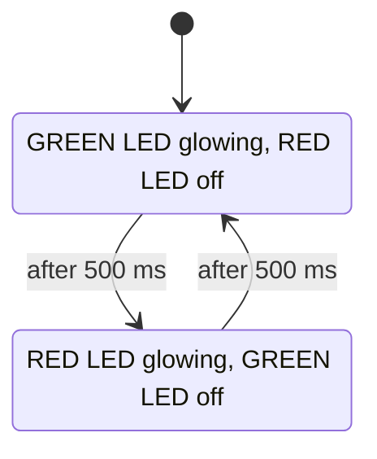
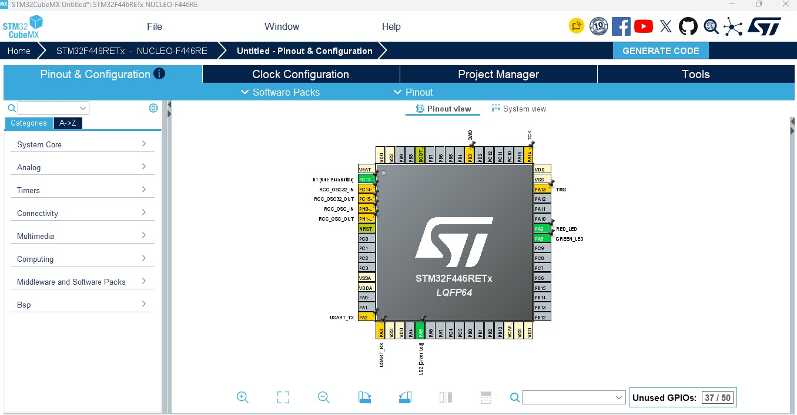
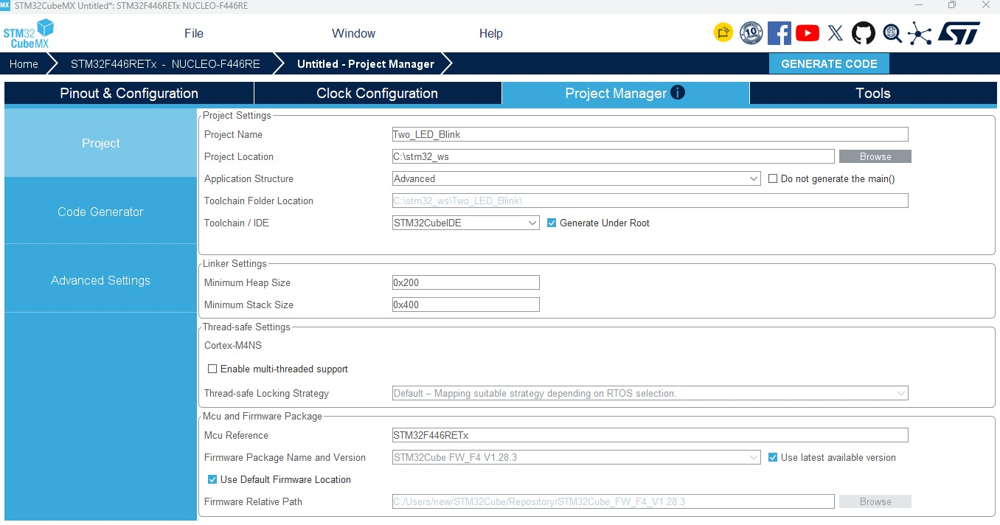
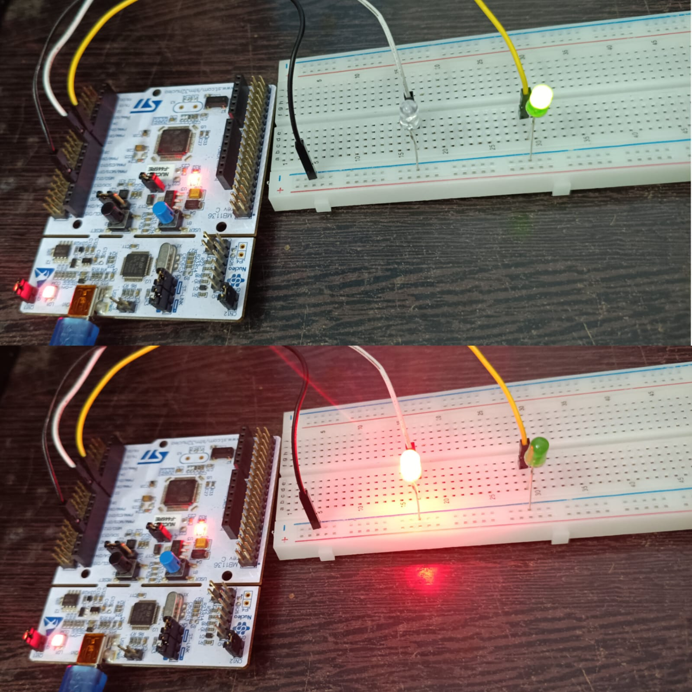

# STM32 NUCLEO-F446RE Two LED Blink

## Project Overview

This project blinks **two external LEDs (green and red)** alternately using the **STM32 NUCLEO-F446RE** board and the STM32 HAL library.

The green LED is connected to **D7 (PA8)** and the red LED to **D8 (PA9)**. Each LED goes from its pin directly to GND. While one LED is glowing the other is OFF, and they swap every **500 ms**.

The project was created with **STM32CubeMX** and built, flashed and run with **STM32CubeIDE 2.2.0**.

## Key Features

- STM32 NUCLEO-F446RE board
- Two external LEDs (green and red)
- GPIO output configuration using STM32CubeMX
- User labels `GREEN_LED` and `RED_LED` for the pins
- STM32 HAL library
- Alternating blink using HAL_GPIO_TogglePin()
- 500 ms delay using HAL_Delay()
- Programming and debugging through the on-board ST-LINK

## Hardware Required

| Component | Quantity |
| --------- | -------- |
| STM32 NUCLEO-F446RE board | 1 |
| Green LED | 1 |
| Red LED | 1 |
| Breadboard | 1 |
| Jumper wires | 3 |
| USB cable (data cable) | 1 |

## Pin Configuration

| Signal | MCU Pin | Arduino Pin | Mode |
| ------ | ------- | ----------- | ---- |
| GREEN_LED | PA8 | D7 | GPIO_Output |
| RED_LED | PA9 | D8 | GPIO_Output |

## Wiring

| Component | Connection |
| --------- | ---------- |
| Green LED long leg (anode, +) | D7 |
| Green LED short leg (cathode, -) | GND |
| Red LED long leg (anode, +) | D8 |
| Red LED short leg (cathode, -) | GND |

## Circuit Diagram

```
 NUCLEO-F446RE
┌──────────────┐
│  D7 (PA8) ───┼────► Green LED (+) ┐
│              │                    │
│  D8 (PA9) ───┼────► Red LED (+)   │
│              │                    │
│  GND ────────┼──── GND rail ◄─────┴── both LED (-) legs
└──────────────┘
```

## LED Glowing Sequence

The two LEDs take turns glowing:



| Time | Green LED (D7) | Red LED (D8) |
| ---- | -------------- | ------------ |
| 0 to 500 ms | 🟢 ON | ⚫ OFF |
| 500 to 1000 ms | ⚫ OFF | 🔴 ON |
| 1000 ms onward | repeats | repeats |

## STM32CubeMX Configuration

### Pinout and Configuration

1. Create a new project and select the **NUCLEO-F446RE** board in the Board Selector.
2. Initialize all peripherals with their default mode.
3. Set **PA8** to `GPIO_Output` and give it the user label `GREEN_LED`.
4. Set **PA9** to `GPIO_Output` and give it the user label `RED_LED`.





### Project Manager and Folder Creation

A parent folder was created first, and CubeMX creates the project folder inside it:

```
C:\stm32_ws        ← parent folder (created manually)
└── Two_LED_Blink  ← created automatically by CubeMX
```

| Setting | Value |
| ------- | ----- |
| Project Name | Two_LED_Blink |
| Project Location | C:\stm32_ws (parent folder, chosen with Browse) |
| Toolchain / IDE | STM32CubeIDE |

Then click **Generate Code** and **Open Project**.





## Code

The code is added in `Core/Src/main.c`.

Between `USER CODE BEGIN 2` and `USER CODE END 2`:

```c
HAL_GPIO_WritePin(GREEN_LED_GPIO_Port, GREEN_LED_Pin, GPIO_PIN_SET);
```

Inside the main loop, between `USER CODE BEGIN 3` and `USER CODE END 3`:

```c
HAL_GPIO_TogglePin(GREEN_LED_GPIO_Port, GREEN_LED_Pin);
HAL_GPIO_TogglePin(RED_LED_GPIO_Port, RED_LED_Pin);
HAL_Delay(500);
```

## Working

At startup all pins are LOW. The green LED is switched ON before the loop, so the red LED starts OFF.

Every 500 ms, `HAL_GPIO_TogglePin()` flips both LEDs, so they take turns:

```
Green ON / Red OFF → wait 500 ms → Green OFF / Red ON → wait 500 ms → repeat
```

## Output

The green and red LEDs glow alternately every 500 ms.





*Green LED glowing while the red LED is OFF.*

## Demonstration Video

[▶️ Watch the Two LED Blink Demonstration](https://drive.google.com/file/d/1WXDewBC3KO12DpFrfgbsDqWkYYcxCPou/view?usp=drivesdk)

## How to Run

1. Wire the LEDs as shown above.
2. Open **STM32CubeIDE**.
3. Go to `File → Import → General → Existing Projects into Workspace`.
4. Select the project folder and click **Finish**.
5. Build the project with the hammer icon.
6. Connect the board with a USB cable.
7. Click **Run** and accept the default debug configuration.

## Testing

| Test | Result |
| ---- | ------ |
| Build | 0 errors, 0 warnings |
| Flash through ST-LINK | Successful |
| Green and red LEDs | Alternate every 500 ms |

## Important Notes

### Pin Mode

Both pins must be set as `GPIO_Output`. If a pin is accidentally set as `GPIO_Input`, that LED stays dark, because an input pin does not drive a voltage.

### LED Connection

In this demonstration each LED is connected directly from the pin to GND, with no series resistor. For long-term use, a 220 Ω to 1 kΩ resistor in series with each LED is recommended, to limit the current drawn from the pin.

### Jumpers

Both **CN2** jumper caps on the board must be fitted. If they are missing, the debugger shows:

```
Error in initializing ST-LINK device.
Reason: No device found on target.
```

### Project Location

In the Project Manager, set the Project Location to the **parent folder** (for example `C:\stm32_ws`), not to a project folder. Otherwise CubeMX adds a second folder inside it and fails with "The system cannot find the path specified".

### Code Placement

Write your own code only between the `USER CODE BEGIN` and `USER CODE END` comments. Anything outside them is erased when the code is regenerated.

## Technologies and Concepts

- STM32 NUCLEO-F446RE
- STM32CubeIDE 2.2.0
- STM32CubeMX
- STM32 HAL library
- GPIO output
- User labels for pins
- HAL_GPIO_WritePin
- HAL_GPIO_TogglePin
- HAL_Delay
- ST-LINK programming and debugging

## Future Improvements

- Push button controlled LEDs
- Ultrasonic sensor distance measurement
- 16×2 I2C LCD display
- UART serial output
- Timer-based blinking without HAL_Delay